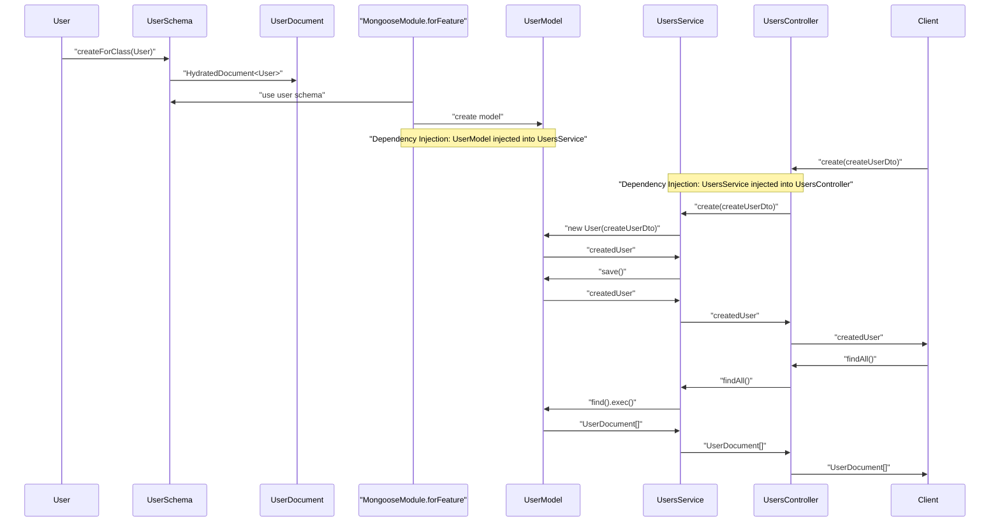
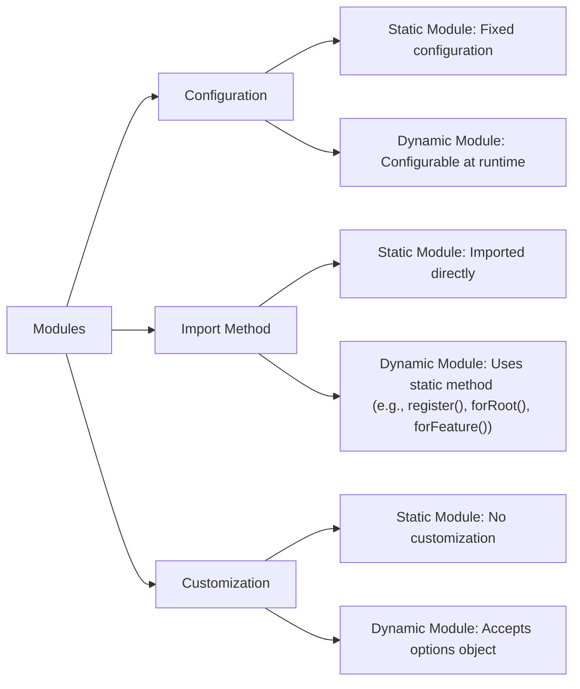
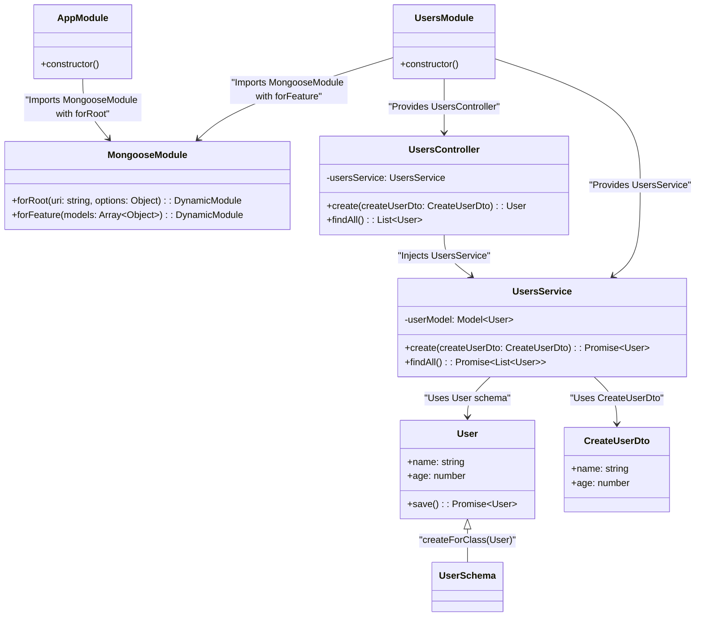
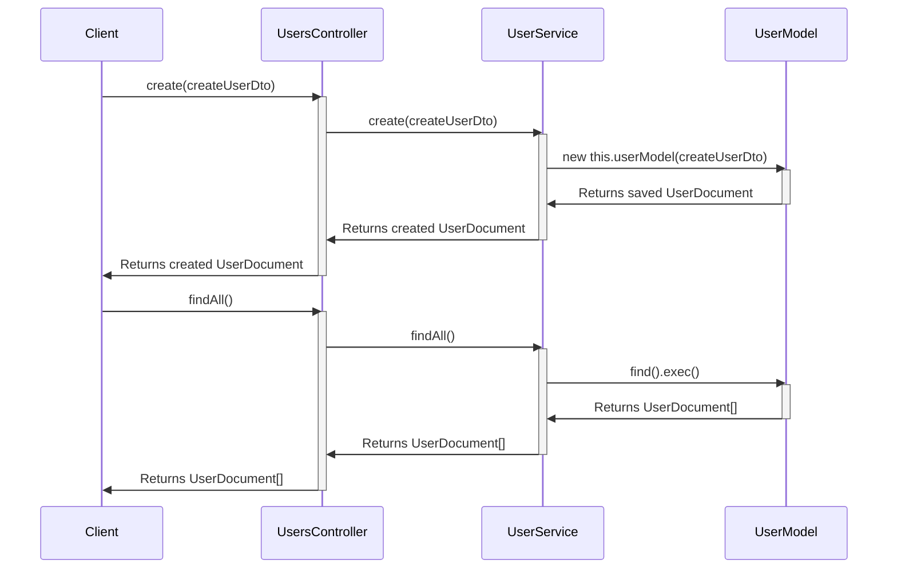

# NestJS MongoDB

This guide provides a simple overview of setting up a NestJS appliuserion with MongoDB using the Mongoose module. It includes creating modules, services, schemas, and integrating Mongoose for database operations, illustrated with diagrams for clarity.

## Overview

### Code Structure
The following sections provide an overview of the structure and the setup for MongoDB integration.

```bash
.
├── app.controller.ts
├── app.module.ts
├── app.service.ts
├── config
│      └── database.config.ts
├── main.ts
└── users
    ├── dto
    │     └── create-user.dto.ts
    ├── schemas
    │      └── user.schema.ts
    ├── user.module.ts
    ├── users.controller.ts
    └── users.service.ts


```
### Flow of interactions

Flow of interactions between the various components of the Users module and the MongoDB database using Mongoose



```mermaid

```
### App Module

```typescript
import { Module } from '@nestjs/common';
import { AppController } from './app.controller';
import { AppService } from './app.service';
import { MongooseModule } from '@nestjs/mongoose';
import { UsersModule } from './users/user.module';
import { ConfigModule, ConfigService } from '@nestjs/config';
import databaseConfig, { CONFIG_DATABASE } from './config/database.config';

@Module({
  imports: [
    ConfigModule.forRoot({
      load: [databaseConfig],
      envFilePath: '.env',
      isGlobal: true,
    }),
    MongooseModule.forRootAsync({
      imports: [ConfigModule],
      useFactory: async (configService: ConfigService) => {
        return {
          uri: configService.get(CONFIG_DATABASE).users.uri,
        };
      },
      inject: [ConfigService],
    }),
    UsersModule,
  ],
  controllers: [AppController],
  providers: [AppService],
})
export class AppModule {}

```

The `AppModule` is the root module of your NestJS application. It imports and configures several modules:

- `ConfigModule`: Loads configuration from .env and is globally available.
- `MongooseModule`: Asynchronously sets up the MongoDB connection using configuration from ConfigModule.
- `UsersModule`: Manages user-related functionality

### Mongoose Module

**Dynamic modules** in NestJS provide an API for importing one module into another with customizable properties and behavior. Unlike static modules, dynamic modules allow you to pass configuration options at runtime, enabling the consuming module to influence how the imported module is set up. This flexibility is particularly useful for modules that require different configurations in different contexts, such as configuration modules that need to adapt to various environments (development, staging, production).



#### MongooseModule.forRoot:

- **Purpose**: Establishes a connection to your MongoDB database(s). It's responsible for:
  Specifying the connection URI (uniform resource identifier) of your MongoDB database.
  Setting up global Mongoose options (e.g., connection pool size, retry settings).
  Defining the connection name if you have multiple databases.
- **Location**: Typically placed in your root AppModule to ensure that the connection is available to the entire appliuserion.
- **Usage**: Called only once per connection.
- **Dynamic Configuration**: `forRootAsync` allows for the MongoDB connection to be configured dynamically at runtime, which is especially useful when the connection URI or other options depend on external sources like environment variables or a configuration service.
#### MongooseModule.forFeature:

- **Purpose**: Registers Mongoose schemas and creates models for specific feature modules. It does the following:
  Associates a schema with a model name.
  Provides the connection name where the model should be registered.
- **Location**: Used within feature modules (e.g., InsightModule, PatientModule, HealthModule) to define the models specific to that module.
- **Usage**: Called once per feature module, for each model you need to work with.

#### In summary:

- `MongooseModule.forRoot` sets up the database connection infrastructure.
- `MongooseModule.forFeature` defines the models you want to use within specific parts of your appliuserion (feature modules).
### Class Diagram

This class diagram shows the relationships between the AppModule, UsersModule, and the related services, controllers, and schemas.




## User Module

The Users module is where all the user-related functionality is encapsulated. It includes the controller, service, and schema definitions.

```typescript
import { Module } from '@nestjs/common';
import { MongooseModule } from '@nestjs/mongoose';
import { UsersController } from './users.controller';
import { UsersService } from './users.service';
import { User, UserSchema } from './schemas/user.schema';

@Module({
  imports: [
    MongooseModule.forFeature([{ name: User.name, schema: UserSchema }]),
  ],
  controllers: [UsersController],
  providers: [UsersService],
})
export class UsersModule {}

```

## User Controller

Users controller handles incoming requests related to users, such as creating, retrieving, and deleting user records.
```typescript
import { Body, Controller, Delete, Get, Param, Post } from '@nestjs/common';
import { UsersService } from './users.service';
import { CreateUserDto } from './dto/create-user.dto';
import { User } from './schemas/user.schema';

@Controller('users')
export class UsersController {
  constructor(private readonly usersService: UsersService) {}

  @Post()
  async create(@Body() createUserDto: CreateUserDto) {
    await this.usersService.create(createUserDto);
  }

  @Get()
  async findAll(): Promise<User[]> {
    return this.usersService.findAll();
  }
}

```
## User Service
The Users service handles the business logic related to users, including creating and retrieving user records from the MongoDB database.

```typescript
import { Model } from 'mongoose';
import { Injectable } from '@nestjs/common';
import { InjectModel } from '@nestjs/mongoose';
import { User } from './schemas/user.schema';
import { CreateUserDto } from './dto/create-user.dto';

@Injectable()
export class UsersService {
  constructor(@InjectModel(User.name) private userModel: Model<User>) {}

  async create(createUserDto: CreateUserDto): Promise<User> {
    const createdUser = new this.userModel(createUserDto);
    return createdUser.save();
  }

  async findAll(): Promise<User[]> {
    return this.userModel.find().exec();
  }
}

```

## User Schema

The User schema defines the structure of the user documents stored in the MongoDB database.

```typescript
import { Prop, Schema, SchemaFactory } from '@nestjs/mongoose';
import { HydratedDocument } from 'mongoose';

export type UserDocument = HydratedDocument<User>;

@Schema()
export class User {
  @Prop()
  name: string;

  @Prop()
  age: number;
}

export const UserSchema = SchemaFactory.createForClass(User);

```


### Create User DTO

Create User DTO defines the structure of the data required to create a new user record.
```typescript
export class CreateUserDto {
  readonly name: string;
  readonly age: number;
}

```

### Relations between User Module Components


### Create And Find All Sequence Diagram



## TEST

```bash
### Create User
POST http://localhost:3000/users
Content-Type: application/json

{
  "name": "John Doe",
  "age": 30
}

### Get All Users
GET http://localhost:3000/users

```

